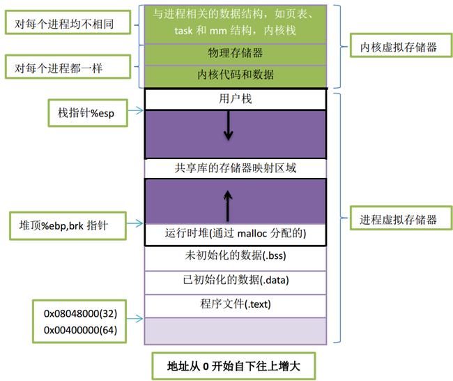

中间代码生成
----------------------

由于不同平台之间的汇编代码存在差异,因此使用一种中间形式的代码来屏蔽底层与平台相关的细节有助于简化代码生成的难度. 而且使用中间代码的形式有助以减少代码优化的难度.

#### 中间代码设计
中间代码有很多种形式,包括三元式,四元式,抽象语法树等. 处于简便性的考虑,我们使用四元式作为中间代码形式.
具体的指令集可见[compile/common.h](../../compile/common.h)


#### 程序运行时结构


如上图所示,一个32位的linux程序的进程空间是分成若干个部分的. 其中可以分成两个主要部分,即进程虚拟存储器和内核虚拟存储器.进程虚拟存储器有我们熟悉的代码段、数据段、运行时堆、共享库段、用户栈. 内核虚拟存储器包括内核中的代码和数据结构、与进程相关的数据结构. 

以32位系统的可执行文件的运行时存储器映像来说：
- 代码段总是从地址0x08048000处开始，它保存编译程序的机器代码
- data段在接下来的一个4KB对齐的地址处，保存已初始化的全局C变量和静态变量
- bss段记录的是未初始化的全局C变量，事实上它并不占据目标文件的任何空间，只是一个占位符
- 运行时堆在接下来的第一个4KB对齐的地址处，通过调用malloc库向上增长，用于程序的动态内存管理
- 共享库段，用于加载共享库、映射共享内存和文件I/O,使用mmap和unmap函数申请和释放新的内存区
- 用户栈占据进程地址空间的最高部分，并向下增长，用于存放调用过程中的局部变量、函数返回地址、参数
- 内核代码和数据、物理存储器，它们均被映射到所有进程共享的物理页面，这就为内核提供一个便利的方法来访问内存中任何特定的位置。对于每个进程来说他们均是一样的
- 最顶层的内核地址空间包括了与进程有关的数据结构，如页表、内核在进程的上下文结构task_struct和mm结构，内核栈

在Lsc语言中,暂时不涉及动态内存分配,因此我们的程序不涉及堆,同时为了简化难度,将所有的数据都合并到.data段,即最后的程序中进包括.data段和.text段,在运行过程中,仅使用用户栈.

#### 函数栈管理
函数的调用操作,返回操作都是固定的. 对于调用者,有如下步骤
1. 参数压栈
2. 调用函数
3. 恢复栈帧
以调用函数f(1,2)为例,依次执行如下汇编代码
```
push 2
push 1
call f
add esp,8
```
注意:
- 按照C语言规则,函数参数应该从右向左依次入栈.
- 由于压入参数导致`esp-8` 因此最后需要通过 `esp+8` 使栈恢复到函数调用之前的状态.

对于被调用者,有如下步骤
1. 保存栈指针
2. 为局部变量分配空间
3. 函数具体代码
4. 恢复栈
还是以调用f(1,2)为例,假设被调函数f有两个局部变量,则需要依次执行如下代码
```
push ebp
mov ebp,esp
sub esp,8
...
...
mov esp,ebp
pop ebp
ret
```
注意:
- 根据上述规则,对于局部变量,地址分别是ebp-4,ebp-8,...
- 对于函数参数,地址分别是ebp+8,ebp+12,...
- ebp+4 保存的是函数的返回地址,由call与ret指令管理